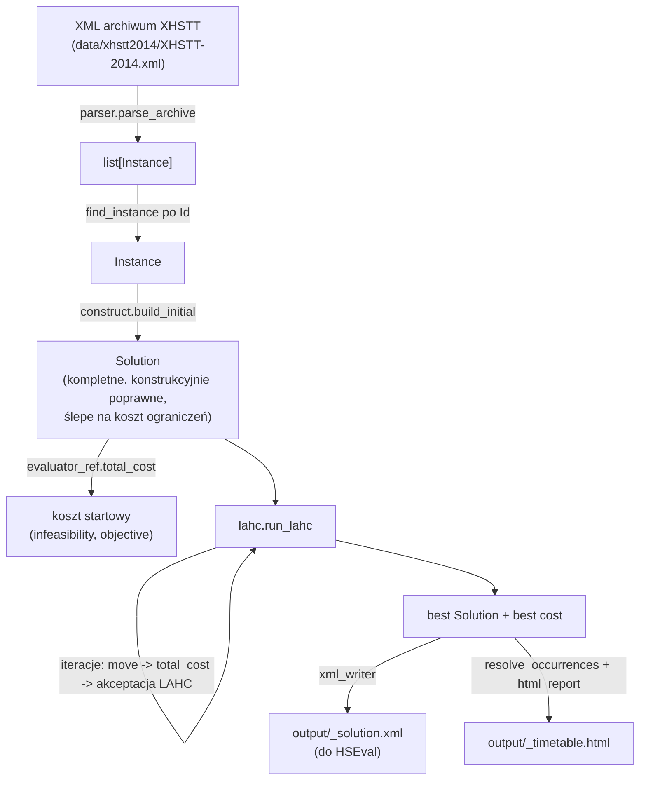

# Flow układania planu zajęć (stan obecny)

Ten dokument opisuje, krok po kroku, co faktycznie dzieje się w kodzie od
wczytania archiwum XHSTT do zapisania gotowego planu — czyli obecnie
zaimplementowany pipeline `construct` + LAHC (patrz `CLAUDE.md` → "Bieżący
stan implementacji" po wyjaśnienie, że to *nie* jest jeszcze docelowa
architektura z selektorem RL/LLM).

Punkt wejścia: `run_solver.py`. Cała logika domenowa leży w `src/`.

## Diagram

## 1. Wczytanie archiwum

`run_solver.py:load_instances` czyta cały plik XML (domyślnie
`data/xhstt2014/XHSTT-2014.xml`, 25 instancji w jednym archiwum) i woła
`src/parser.py:parse_archive`, które zwraca `list[Instance]`.

Parser (czysty `xml.etree.ElementTree`, bez zewnętrznych zależności) mapuje
strukturę XHSTT 1:1 na dataclassy z `model.py`:

- `Times`/`TimeGroups` → `Time` (z `group_refs`, m.in. do której grupy typu
  `Day` należy) i `Group` (kind = nazwa tagu XML, np. `Day`, `Week`).
- `Resources`/`ResourceTypes`/`ResourceGroups` → `Resource`, `ResourceType`.
- `Events`/`EventGroups` → `Event` — każdy z listą `EventResource` (role +
  ewentualne preprzypisanie `resource_ref`/`resource_type_ref`) i opcjonalnym
  preprzypisanym `time_ref`.
- `Constraints` → `Constraint`, generyczny dla wszystkich 16 typów XHSTT:
  parametry specyficzne dla typu (np. `MinimumDuration`, `TimeGroups`,
  `Resources`) trafiają do `params: dict`, a nie do dedykowanych pól.

`find_instance` wybiera jedną `Instance` po `Id` (np. `AU-BG-98`).

## 2. Budowa rozwiązania początkowego (`construct.build_initial`)

Zachłanny, "ślepy na koszt" konstruktor — jedyny cel to wyprodukować
**kompletne** i **strukturalnie poprawne** rozwiązanie (bez żadnych `None`),
które local search może dalej poprawiać. Dla każdego `Event` z instancji:

1. Jeśli zdarzenie ma już ustalony czas *i* wszystkie zasoby preprzypisane
   (`needs_time = False` i brak `unassigned_roles`) — pomijane całkowicie
   (nie trafia do `Solution.events`; taki wpis nie jest wymagany przez
   format XHSTT dla w pełni preprzypisanych zdarzeń).
2. Dla każdej nieprzypisanej roli zasobu wybierany jest **jeden** losowy
   zasób pasującego typu (`role_choices`) — ten sam wybór jest reużywany
   dla wszystkich "kawałków" zdarzenia (patrz niżej), więc np. nauczyciel
   przypisany do kursu zostaje ten sam we wszystkich jego wystąpieniach.
3. Jeśli zdarzenie ma już czas, ale brakuje mu zasobów — dostaje jeden
   `SolutionEvent` bez `time_ref`, tylko z uzupełnionymi zasobami.
4. Jeśli zdarzenie potrzebuje czasu:
   - `_split_duration_bounds` sprawdza, czy na zdarzenie działa
     `SplitEventsConstraint` (`MinimumDuration`/`MaximumDuration`); jeśli
     nie — cała długość (`event.duration`) idzie jako jeden kawałek.
   - `_split_durations` dzieli całkowitą długość na kawałki mieszczące się
     w tym przedziale, preferując mniej i większych kawałków (np. bloki
     dwugodzinne zamiast pojedynczych godzin) — wzorem realnych rozwiązań
     referencyjnych (BrazilInstance1 / HSEval).
   - Dla każdego kawałka `valid_start_time_ids(instance, duration)` zwraca
     listę czasów startu, przy których zdarzenie **nie wyjdzie poza
     ostatni zdefiniowany `Time`** i **nie przetnie granicy dnia** (grupa
     typu `Day`) — losowo wybierany jest jeden z nich (albo dowolny `Time`
     jako fallback, gdy lista kandydatów jest pusta).

Wynik: `Solution` z listą `SolutionEvent` — kompletna, ale losowa i zwykle
dużym kosztem naruszeń.

## 3. Ocena kosztu (`evaluator_ref.py`)

Każde porównanie dwóch rozwiązań (start, po ruchu, wynik końcowy) idzie tą
samą ścieżką:

1. `resolve_occurrences(instance, solution)` scala dla każdego zdarzenia
   preprzypisania z `Instance` z nadpisaniami z `Solution` w listę
   `Occurrence` (jedno wystąpienie na `SolutionEvent`; zdarzenie w pełni
   preprzypisane, którego `Solution` nigdy jawnie nie wymienia, dostaje
   jedno "syntetyczne" wystąpienie, żeby ewaluator je w ogóle widział).
2. `evaluate_constraint(instance, occurrences, constraint)` dispatchuje po
   `constraint.type` do jednej z ~16 funkcji `_evaluate_*_constraint`
   (jedna na typ ograniczenia XHSTT), która liczy **odchylenie**
   (deviation) od wymogu ograniczenia i mnoży je przez `constraint.weight`
   po przepuszczeniu przez `apply_cost_function` (`Linear` = deviation,
   `Quadratic` = deviation², `Step` = 1 jeśli deviation≠0).
3. `total_cost(instance, solution)` sumuje osobno koszty ograniczeń
   `Required=true` (**infeasibility**) i `Required=false` (**objective**),
   po czym łączy je leksykograficznie w jeden skalar:
   `infeasibility * 1_000_000 + objective` — tak, że jakiekolwiek naruszenie
   twarde zawsze przeważa nad dowolną sumą kosztów miękkich. Ten skalar to
   jedyna wartość, którą porównuje `lahc.py`.

Moduł mocno cache'uje (`functools.lru_cache`, klucz `id(instance)`) dane
statyczne per instancja (przynależność zdarzeń do grup, poprawne czasy
startu itd.), bo te same obliczenia wykonują się setki tysięcy razy na
jeden przebieg LAHC.

## 4. Lokalne przeszukiwanie — LAHC (`lahc.py`)

`run_lahc(instance, initial, rng, history_length=30, max_iterations=...)`
implementuje Late Acceptance Hill Climbing (Burke & Bykov):

1. `current = initial`, `current_cost = total_cost(current)`,
   `best = current`. Bufor `history` (długość `history_length`) startuje
   wypełniony `current_cost`.
2. W każdej iteracji:
   - losowo wybierany jest jeden operator z puli `MANUAL_HEURISTICS`
     (`src/heuristics.py`, 8 operatorów, każdy o kontrakcie
     `apply(solution, instance, rng) -> Solution`):
     - `move_random` — losowe przesunięcie jednego zdarzenia na inny poprawny
       czas startu,
     - `move_best` — przesunięcie losowego zdarzenia na czas minimalizujący
       `total_cost` (przegląd wszystkich poprawnych slotów),
     - `swap` — zamiana czasów dwóch losowych zdarzeń (tylko gdy poprawna
       dla obu stron),
     - `repair_hard_violation` — przesunięcie losowego zdarzenia uczestniczącego
       w naruszeniu ograniczenia `Required` na jego najlepszy czas,
     - `resource_reassign` — podmiana zasobu zdarzenia na inny tego samego
       typu,
     - `kempe_chain` — Kempe chain interchange między dwoma slotami czasowymi,
     - `ruin_and_recreate` — zniszczenie małej losowej porcji rozwiązania i
       zachłanna odbudowa zdarzenie po zdarzeniu,
     - `large_perturbation` — duże losowe przesunięcie wielu zdarzeń jednocześnie
       (silna perturbacja do wychodzenia z minimum lokalnego),
   - operator stosowany jest do `current` → `candidate`; jeśli nie może być
     zastosowany (np. brak zdarzeń z ruchowalnym czasem, brak zasobu
     alternatywnego), rzuca `ValueError` — iteracja pomijana,
   - liczony jest `candidate_cost = total_cost(candidate)`,
   - **reguła akceptacji LAHC**: kandydat jest akceptowany, jeśli jest nie
     gorszy niż bieżący koszt **LUB** nie gorszy niż koszt sprzed
     `history_length` kroków (`history[step % history_length]`),
   - po akceptacji `current`/`current_cost` się aktualizują, a jeśli to
     najlepszy dotąd wynik — aktualizuje się też `best`,
   - bufor `history` w tym slocie zapisuje aktualny `current_cost`.
3. Co `progress_every` iteracji **lub** co `progress_seconds` sekund
   (co pierwsze) wywoływany jest callback `on_progress` — daje żywy
   sygnał postępu nawet na dużych/wolnych instancjach.
4. Zwracana jest para `(best, best_cost)`.

Ruchy z `moves.py` (każdy zwraca **nowy** `Solution`, budowany przez
`dataclasses.replace` ze strukturalnym współdzieleniem reszty danych —
`deepcopy` całego rozwiązania był profilowany jako główny hot-spot):

- `time_reassign_move` — bierze losowe zdarzenie i przenosi je na inny,
  poprawny (`valid_start_time_ids`) czas startu.
- `time_swap_move` — zamienia czasy dwóch losowych zdarzeń, ale tylko jeśli
  zamiana jest poprawna dla **obu** stron (różne długości zdarzeń mogą
  sprawić, że zamiana ważna dla jednej strony przepełni drugą); próbuje
  ograniczoną liczbę losowych par, zanim podda się z `ValueError`.
- `resource_reassign_move` — bierze losową (zdarzenie, rola zasobu) parę i
  podmienia przypisany zasób na inny tego samego typu.

## 5. Zapis wyniku

Po zakończeniu LAHC (`run_solver.py`):

1. `evaluate_cost_components(best)` ponownie liczy `infeasibility`/`objective`
   do wypisania różnicy względem stanu startowego.
2. `xml_writer.extract_instance_archive` wycina z oryginalnego archiwum
   XML tylko rozwiązywaną instancję (żeby nie ciągnąć pozostałych 24 przy
   wysyłce do HSEval).
3. Budowany jest `SolutionGroup` z jednym `Solution` (`best`), renderowany
   przez `xml_writer.render_archive_with_solution_groups` do sekcji
   `<SolutionGroups>` (z wymaganym przez HSEval blokiem `<MetaData>`) i
   zapisywany jako `output/<id>_solution.xml` — to jest artefakt do
   walidacji zewnętrznym ewaluatorem HSEval.
4. `resolve_occurrences(best)` liczone jest jeszcze raz (na potrzeby
   renderowania), a `html_report.render_timetable_page` buduje samodzielną
   stronę HTML: siatkę dzień×godzina dla każdego zasobu (nauczyciel/sala/
   klasa, przełączane zakładkami po stronie klienta, bez serwera i bez
   zewnętrznych assetów) plus sekcję "Ocena rozwiązania" z tabelami
   ograniczeń wymaganych/preferowanych (domyślnie pokazuje tylko
   naruszone). Zapisywana jako `output/<id>_timetable.html`.

## Czego w tym flow nie ma (jeszcze)

**Zaimplementowane, ale jeszcze nie w pełni podłączone:**

- Kontrakt heurystyk `apply(solution, instance, rng)` **już istnieje**
  (`src/heuristics.py`, `MANUAL_HEURISTICS`, 8 operatorów) i jest podłączony
  do `lahc.py` — opis w sekcji "Bieżący stan implementacji" `CLAUDE.md`
  jest w tej kwestii nieaktualny.
- Ewaluacja przyrostowa (`src/delta.py:delta_cost`) **już istnieje**,
  przetestowana (invariant 10 000 ruchów) i zbenchmarkowana, ale `lahc.py`
  nadal woła `evaluate_cost` (pełna ewaluacja) przy każdej iteracji —
  podłączenie `delta_cost` do pętli LAHC to osobna decyzja projektowa poza
  zakresem bieżącego refaktoringu.

**Jeszcze brak:**

- Selektor RL (UCB) — wybór heurystyki to `rng.choice(pool)`, nie
  `argmax Q + c*sqrt(ln N / n)` z Etapu 6 `CLAUDE.md`.
- Generator LLM, sandbox i pipeline walidacji nowych heurystyk (Etap 7).
- Symulowane wyżarzanie jako reguła akceptacji (docelowo Etap 5) — aktualnie
  reguła LAHC (Burke & Bykov).
